<h1 align="center">Hey, I'm JBros Development</h1>

<p align="center">
<a href="https://jbros-development.web.app">
    
</a>
<a href="https://jbros-development.web.app">
  
</a>
</p>

#### I'm a young software developer. I've had 2-3 years of experience now and have worked on many projects and games. Check out the <a href="https://jbrosdev.hashnode.dev/">blog</a> I post on every once in a while.

<h1 align="center">Website</h1>

#### Please check out my website: https://jbros-development.web.app

<h1 align="center">My Best Projects</h1>

<div align="center">
<h3><a href="https://github.com/JBrosDevelopment/calc_lang">Calculator Language</a> | <a href="https://github.com/JBrosDevelopment/TerminalEngine">Terminal Engine</a> | <a href="https://github.com/JBrosDevelopment/VirtualComputer">Virtual Computer</a></h3>
  <div>
    <a href="https://github.com/EZCodeLanguage/EZCode">
    </a>
  </div>
  <div>
    <a href="https://github.com/JBrosDevelopment/Norma">
    </a>
  </div>
  <div>
  </div>
</div>

---

```c

for (int i = 0; i < MILLION; i++) {
  print("thanks for visiting!");
} 

```
